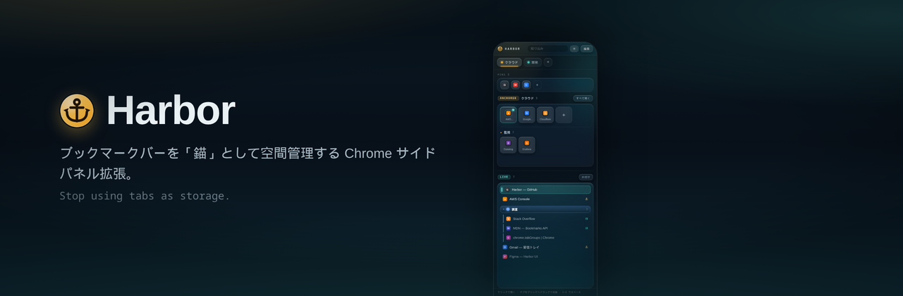
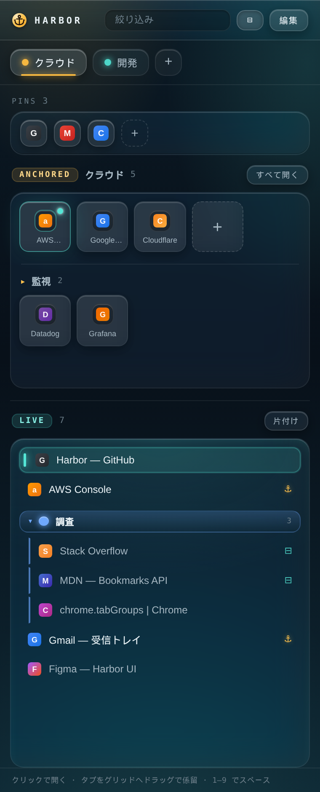

<p align="center">
  
</p>

# Harbor

**ブックマークバーを「錨(Anchor)」として空間管理する Chrome サイドパネル拡張。**
タブを保存場所として使うのをやめ、恒久的な戻り先(Anchor)＝ブックマークと、流動的な作業(Live tabs)を分離する。

錨の実体は **Chrome のブックマーク** です。だからインポート/エクスポート/端末間同期はブラウザ標準の仕組みにそのまま乗ります。Harbor 独自に持つのは色などの薄いメタ情報だけ。

見た目は **「Liquid Harbour」**——2026年的なスキューモーフィズム（Liquid Glass）。重厚なテクスチャや光沢ベベルではなく、**すりガラスの半透明・実時間ブラー・鏡面ハイライト**と、港の夜の水面に滲む琥珀/ティールの光で奥行きを出します。すべてCSSのみ、外部通信なし。

## スクリーンショット

<p align="center">
  
</p>

> 掲載画像はすべて `assets/preview.html`（`chrome.*` をモックしたダミーデータ）から撮影しています。実際のブックマークやタブは含まれません。Chrome Web Store 掲載用の素材は [`store/`](store/) に置いています（1280×800 スクリーンショット・440×280 小タイル・1400×560 マーキー）。

- **PINS** … ブックマークバー**直下の裸ブックマーク**。スペースとは別に、上部の真鍮レールに常時並ぶグローバルなお気に入り。タブをドラッグでピン留め。
- **ANCHORED** … 選択中スペース（フォルダ）のブックマークを真鍮メダリオンのグリッドで表示。クリックで「既存タブにフォーカス、無ければ開く」。今開いているURLの錨は点灯。サブフォルダは折りたたみセクション。
- **LIVE** … 現在ウィンドウのタブを**縦型タブ**として表示。Chrome のタブグループを色・名前・折りたたみ付きで束ね、グループへの追加/新規作成/解除/改名/色変更が可能。グリッドへ**ドラッグで係留**、グループヘッダへ**ドラッグで仲間入り**。錨済みタブには ⚓、分割ビューのタブには ⊟ を表示。
- **Spaces** … 上部のピル＝**ブックマークバー直下のフォルダのみ**。ドラッグで並べ替え、`1–9` で切替。「すべて開く」で錨を一括（タブグループ化）、「片付け」でどこにも保存していないタブを一掃。

> **Space と Chrome のタブグループは別概念**です。Space は「錨の入れ物（フォルダ）＝切替できる作業文脈」、タブグループは LIVE 側で現在のタブを束ねる道具。
>
> **分割ビュー（Split View）** は拡張APIの制約で、**検出・表示のみ**可能です（⊟ で表示）。分割の作成/解除はブラウザ操作で行ってください（Chrome は `tab.splitViewId` を公開するものの、分割を組む/外すAPIは未提供）。

## インストール（Load unpacked）

1. `chrome://extensions/` を開く
2. 右上の「デベロッパーモード」をオン
3. 「パッケージ化されていない拡張機能を読み込む」→ この `harbor` フォルダを選択
4. ツールバーの錨アイコンをクリック（または `Ctrl/Cmd+Shift+K`）でサイドパネルが開く

> フォルダの実体を参照するので、移動・削除すると外れます。固定パスに置いてください。
> コードを変更したら `chrome://extensions/` の更新ボタン（または再読み込み）で反映。

## 使い方

- **錨を追加**: グリッドの「＋ 現在のタブ」、LIVE 行の ⚓、または **LIVE タブをグリッドへドラッグ**
- **錨をクリック**: 既存タブにフォーカス / 無ければ開く
- **⟲**（錨タイル左上・ホバー時）: 今のアクティブタブをその錨のURLに戻す（スナップバック）
- **並べ替え**: 錨タイルをドラッグ（=ブックマークの並び替えとして永続化）。別フォルダ（セクション）へも移動可
- **編集/削除**: 「編集」モードでタイルクリック→モーダル、× で削除（**Undo** スナックバー付き）
- **スペース**: ピルを切替/`1–9`、ドラッグで並べ替え、「＋」で追加（=バーにフォルダ作成）、「編集」で改名・色・削除
- **セクション**: スペース内のサブフォルダは折りたたみ表示
- **絞り込み**: 上部の入力でスペース内をフィルタ。⊟ で表示密度（コンパクト/標準）切替

## データモデル（ブックマーク連動）

| Harbor の概念 | ブックマーク上の実体 |
|---|---|
| Pin | ブックマークバー直下の裸ブックマーク（フォルダではない url ノード） |
| Space | ブックマークバー直下のフォルダ |
| Anchor | スペースフォルダ内のブックマーク（url ノード） |
| Section | スペースフォルダ内のサブフォルダ |

- **インポート**: 既存のブックマークがそのまま錨になる（作業不要）
- **エクスポート**: Chrome 標準のブックマーク出力（`chrome://bookmarks` → 整理 → エクスポート）
- **同期**: Chrome アカウントのブックマーク同期にそのまま乗る
- Harbor 固有のメタ情報（スペースの色、折りたたみ状態、アクティブスペース、表示密度）だけを
  `chrome.storage.local` の `harbor:meta:v2` に保存

## カスタマイズの勘どころ

- 質感・配色: `sidepanel.css` の `:root` 変数（`--glass*`/`--hairline`/`--spec`/`--blur` = ガラス材, `--anchor` = 琥珀/恒久, `--live` = ティール/流動, `--bg-*` = 港の夜）
- 管轄ルート: `sidepanel.js` の `resolveBarId()`（既定はブックマークバー）
- 既存タブ判定のゆるさ: `sidepanel.js` の `sameTarget()`（現在は origin + pathname 一致）
- 追加候補: Cmd-K 風のコマンドバー（錨/タブ/履歴を横断検索）、錨を別スペースへドラッグ移動、使用頻度順ソート

## 開発プレビュー

実拡張として読み込まなくても、`chrome.*` をモックした `assets/preview.html` でUIを確認できます。
リポジトリ直下で簡易サーバを立て、`/assets/preview.html` を開くだけ（実コード `sidepanel.js` / `sidepanel.css` をそのまま使用）。

```sh
python3 -m http.server 4178   # → http://localhost:4178/assets/preview.html
```

## 権限

- `sidePanel` サイドパネル表示
- `tabs` タブのURL/タイトル取得・フォーカス・新規・クローズ・グループ化
- `storage` メタ情報の保存
- `favicon` ファビコン取得（`_favicon/` エンドポイント）
- `tabGroups` 「すべて開く」時のタブグループ化
- `bookmarks` 錨/スペースの実体（ブックマーク）の読み書き

外部通信は行いません。すべてローカル。

## ライセンス

Copyright (C) 2026 nemototea

本プログラムはフリーソフトウェアです。Free Software Foundation が公開する
GNU General Public License バージョン3（またはそれ以降の任意のバージョン）の
条件の下で、再頒布および改変ができます。詳細は [LICENSE](LICENSE) を参照してください。

> Harbor is free software: you can redistribute it and/or modify it under the
> terms of the GNU General Public License as published by the Free Software
> Foundation, either version 3 of the License, or (at your option) any later
> version. This program is distributed WITHOUT ANY WARRANTY. See the
> [LICENSE](LICENSE) file for details.

派生物・再頒布物も同じ GPL-3.0 の下でソースコードを公開する必要があります
（クローズドソース化や、ソース非公開のままの再配布はできません）。
