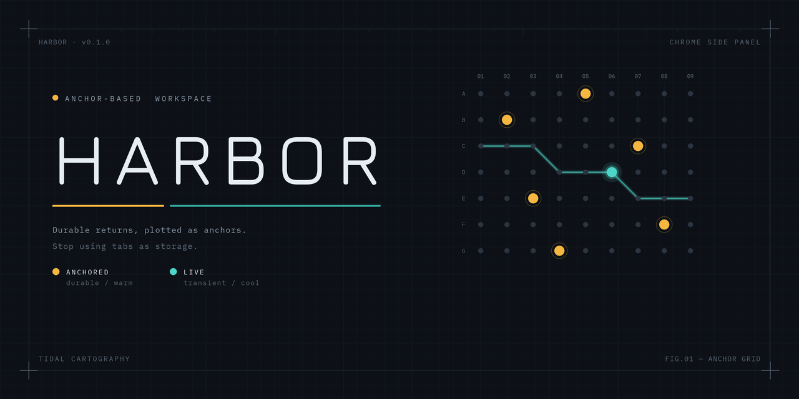

  

# Harbor

**ブックマークバーを「錨(Anchor)」として空間管理する Chrome サイドパネル拡張。**
タブを保存場所として使うのをやめ、恒久的な戻り先(Anchor)＝ブックマークと、流動的な作業(Live tabs)を分離する。

錨の実体は **Chrome のブックマーク** です。だからインポート/エクスポート/端末間同期はブラウザ標準の仕組みにそのまま乗ります。Harbor 独自に持つのは色などの薄いメタ情報だけ。

- **ANCHORED** … ブックマークのファビコングリッド。クリックで「そのURLの既存タブにフォーカス、無ければ新規で開く」。今そのURLを開いているタブがあれば点灯（⚓ docked）。
- **LIVE** … 現在ウィンドウのタブ。グリッドへ**ドラッグで係留**（=ブックマーク作成）、⚓ で昇格、× で閉じる。既に錨になっているタブには ⚓ マークが付く。
- **Spaces** … 上部のピル＝**ブックマークバー直下のフォルダ**。先頭の「バー」はバー直下の裸ブックマーク。ドラッグで並べ替え、`1–9` で切替。「すべて開く」でスペースの錨を一括（タブグループ化）、「片付け」で錨でないタブを一掃。

> Space と Chrome のタブグループは別概念です。Space は「錨の入れ物（フォルダ）＝切替できる作業文脈」、タブグループは「すべて開く」した**結果**の入れ物として使います。

## インストール（Load unpacked）

1. `chrome://extensions/` を開く
2. 右上の「デベロッパーモード」をオン
3. 「パッケージ化されていない拡張機能を読み込む」→ この `harbor` フォルダを選択
4. ツールバーの錨アイコンをクリック（または `Ctrl/Cmd+Shift+K`）でサイドパネルが開く

> フォルダの実体を参照するので、移動・削除すると外れます。固定パスに置いてください。
> コードを変更したら `chrome://extensions/` の更新ボタン（または再読み込み）で反映。

## 使い方

- **錨を追加**: グリッドの「＋ 現在のタブ」、LIVE 行の ⚓、または **LIVE タブをグリッドへドラッグ**
- **錨をクリック**: 既存タブにフォーカス / 無ければ開く
- **⟲**（錨タイル左上・ホバー時）: 今のアクティブタブをその錨のURLに戻す（スナップバック）
- **並べ替え**: 錨タイルをドラッグ（=ブックマークの並び替えとして永続化）。別フォルダ（セクション）へも移動可
- **編集/削除**: 「編集」モードでタイルクリック→モーダル、× で削除（**Undo** スナックバー付き）
- **スペース**: ピルを切替/`1–9`、ドラッグで並べ替え、「＋」で追加（=バーにフォルダ作成）、「編集」で改名・色・削除
- **セクション**: スペース内のサブフォルダは折りたたみ表示
- **絞り込み**: 上部の入力でスペース内をフィルタ。⊟ で表示密度（コンパクト/標準）切替

## データモデル（ブックマーク連動）

| Harbor の概念 | ブックマーク上の実体 |
|---|---|
| Space | ブックマークバー直下のフォルダ（先頭「バー」はバー直下の裸ブックマーク） |
| Anchor | ブックマーク（url ノード） |
| Section | スペースフォルダ内のサブフォルダ |

- **インポート**: 既存のブックマークがそのまま錨になる（作業不要）
- **エクスポート**: Chrome 標準のブックマーク出力（`chrome://bookmarks` → 整理 → エクスポート）
- **同期**: Chrome アカウントのブックマーク同期にそのまま乗る
- Harbor 固有のメタ情報（スペースの色、折りたたみ状態、アクティブスペース、表示密度）だけを
  `chrome.storage.local` の `harbor:meta:v2` に保存

## カスタマイズの勘どころ

- 配色・余白: `sidepanel.css` の `:root` 変数（`--anchor` = 暖色/恒久, `--live` = 寒色/流動）
- 管轄ルート: `sidepanel.js` の `resolveBarId()`（既定はブックマークバー）
- 既存タブ判定のゆるさ: `sidepanel.js` の `sameTarget()`（現在は origin + pathname 一致）
- 追加候補: Cmd-K 風のコマンドバー（錨/タブ/履歴を横断検索）、錨を別スペースへドラッグ移動、使用頻度順ソート

## 権限

- `sidePanel` サイドパネル表示
- `tabs` タブのURL/タイトル取得・フォーカス・新規・クローズ・グループ化
- `storage` メタ情報の保存
- `favicon` ファビコン取得（`_favicon/` エンドポイント）
- `tabGroups` 「すべて開く」時のタブグループ化
- `bookmarks` 錨/スペースの実体（ブックマーク）の読み書き

外部通信は行いません。すべてローカル。
